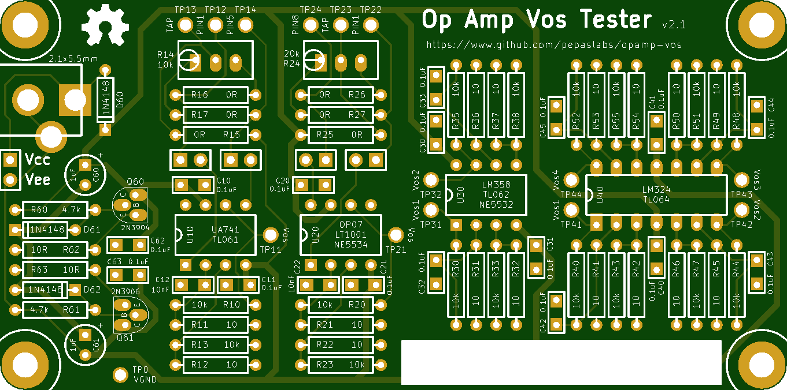
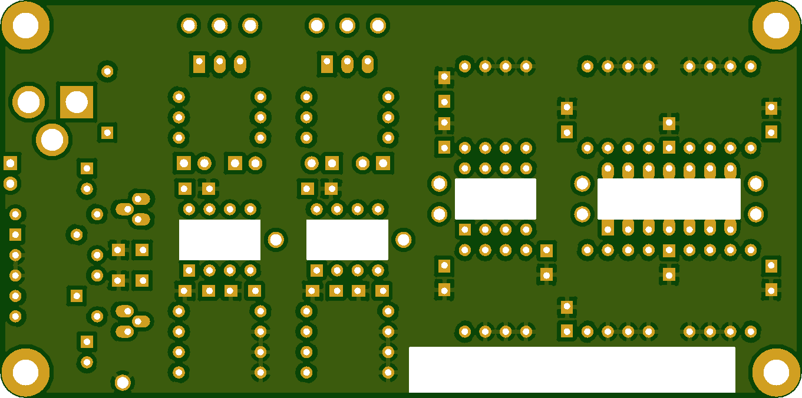

# opamp-vos

A board to measure the Vos (input offset voltage) of op amps.

# Latest release: v2.1

* Gerbers: [gerbers.zip](kicad/releases/v2.1/gerbers.zip)
* Schematic: [pdf](kicad/releases/v2.1/opamp-vos.pdf).

# License

This board design is [Open-Source Hardware](http://www.oshwa.org/definition/).  It is licensed under the [MIT License](http://opensource.org/licenses/MIT).  It was designed by Jason Pepas.

